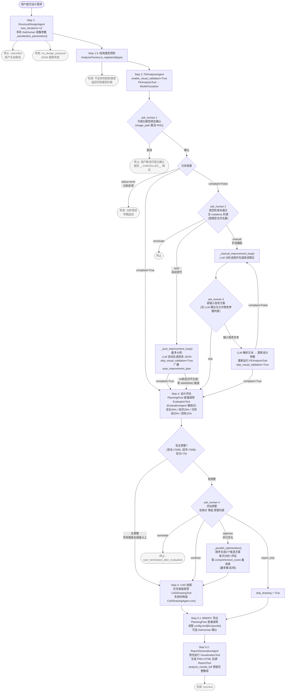

# 结构设计系统完整工作流



---

## 各步骤详解

### Step 1：设计方案生成（StructuralDesignAgent）

**Agent**：`StructuralDesignAgent`（`max_iterations=12`）

**工具集**：`AskHuman` / `WebAskHuman`（由 PlanningFlow 在 Web 模式下注入）、`CreateChatCompletion`、`Terminate`

**System Prompt 动态生成**：构造时从 `AnalyzerFactory.get_available_types()` 读取支持的结构类型，写入 Prompt，LLM 不会生成未注册的类型。每种类型附有完整参数格式说明及荷载换算公式（桁架端/内节点换算、框架楼面→线荷载等）。`units` 字段为**必填项**。

**AskHuman 两种模式**：
- **结构化模式**（推荐）：`question + options + context`，前端渲染为单选按钮
- **遗留文本模式**（兜底）：`inquire` 字段，含序号列表，有解析风险

**内置交互规则**：模糊表述/缺失参数/矛盾参数均触发 ask_human 澄清；用户说"算了"先 ask_human 确认再 terminate（防误判）；"请你补全"模式展示默认值列表由用户确认。

**JSON 提取（4级 fallback）**：
1. ` ```json ... ``` ` 代码块（优先）
2. `create_chat_completion executed: {...}` 日志块
3. ` ``` ... ``` ` 普通代码块
4. 含 `"type"` 字段的平衡 JSON 对象

**_standardize_parameters() 后处理**：

| 结构类型 | 处理内容 |
|---------|---------|
| 所有类型 | 检测 `geometry.length` 与 `geometry.span` 矛盾并打印警告 |
| `truss` | `length→span`、`n_elements→n_panels` 别名转换 |
| `truss` | n_panels 缺失时推断为 `max(3, min(8, int(span/1.5)))` |
| `truss` | A 缺失时按荷载大小推断截面积 |
| `truss` | distributed/point 荷载 → 节点荷载（端节点半载，内节点全载）并删除原格式 |

**取消检测**：PlanningFlow 检查返回字符串是否含 `"completed with status: failure"` 或 `"completed with status: cancelled"`，是则终止工作流，返回 `{"status": "cancelled", "reason": "user_cancelled"}`。

**无效 JSON 检测**：提取失败（所有 fallback 均失败）→ 返回 `{"status": "failed", "reason": "no_design_proposal"}`。

---

### Step 1.5：结构类型预检

**执行方**：PlanningFlow 直接执行，无 Agent 参与。

**逻辑**：`AnalyzerFactory.is_registered(structure_type)`，若不在注册列表（`beam` / `cantilever_beam` / `continuous_beam` / `truss` / `frame`），立即终止工作流并返回可用类型列表与参考文档链接。

---

### Step 2：有限元分析（FEAnalysisAgent）

**Agent**：`FEAnalysisAgent`（`enable_loop=False`，`enable_visual_validation=True`）

**工具集**：`FEAnalysisTool`、`AskHuman` / `WebAskHuman`

**输出目录**：PlanningFlow 在调用前设置 `analysis_agent.output_dir = str(self.main_output_dir)`。

#### 子流程：可视化模型预览确认（AH1）

1. 先调用 `FEAnalysisTool` 进行有限元建模与分析
2. 若 `enable_visual_validation=True`，调用 `ModelVisualizer` 生成结构预览 PNG（5 种结构类型均支持）
3. 通过 `AskHuman`（含 `image_path` 字段）推送给前端，等待用户确认
4. 用户**取消** → Agent 返回 `"__CANCELLED__"` 哨兵值，PlanningFlow 检测后终止工作流
5. 用户**确认** → 返回分析结果

#### 分析结果分支

- `status == "error"` → PlanningFlow 早期返回 `{"status": "failed", "error": ...}`
- `code_check.compliant == True` → 进入 Step 3
- `code_check.compliant == False` → 触发规范检查失败流程

#### AH2：规范检查失败处理

违规项按类型合并去重后展示给用户，三个选项：

| 选项 | 行为 |
|------|------|
| `auto` | `_auto_improvement_loop()`：最多10轮，LLM 自动生成改进 JSON，`skip_visual_validation=True` |
| `manual` | `_manual_improvement_loop()`：LLM 生成建议 → AH3 用户输入 → LLM 更新参数 → 重新分析（循环） |
| `terminate` | 返回 `{"status": "terminated"}` |

**auto 循环细节**：
- 最多10轮（`max_loops=10`），每轮广播 `auto_improvement_plan` 至前端
- `_validate_design_params()` 校验新参数合理性（宽度/高度/跨度/材料范围），不合理则跳过本轮
- 超出10轮仍不合规：打印 `[WARNING]` 并**带警告继续**进入 Step 3

**manual 循环细节**：
- LLM 分析违规并生成具体改进建议（含 `_get_allowed_params()` 返回的可修改参数列表和当前值）
- AH3 中用户输入改进文本（或选择 `skip` 直接进入 Step 3）
- LLM 解析文本生成更新后的设计 JSON，重新分析，若不合规继续循环

**副产物**：分析成功后自动调用 `analyzer.export_opensees_script()` 导出 `opensees_script.tcl` 至输出目录，供专家复核。

---

### Step 3：设计评估（_run_evaluation）

**执行方**：PlanningFlow 直接调用 `EvaluationTool`（**EvaluationAgent 在主流程中被完全绕过**）。

**评分维度与权重**（以梁为例）：安全性（45%）、经济性（20%）、可持续性（20%）、结构效率（15%）。

**评分等级**：A+（≥95）/ A（90-94）/ B+（85-89）/ B（80-84）/ C+（75-79）/ C（70-74）/ D（<70）

#### 预警触发条件（`_handle_evaluation_alert`）

| 检查项 | 触发阈值 | 预警等级 |
|--------|---------|---------|
| safety_score | < 60 | 严重 |
| safety_score | 60 ≤ x < 70 | 警告 |
| economy_score | < 60 | 严重 |
| economy_score | 60 ≤ x < 70 | 警告 |
| comprehensive_score | < 70 | 不合格 |

无任何预警（所有维度均高于阈值）→ **直接进入 Step 4，不显示 AH4**。

#### AH4：评估预警处理

| 选项 | 行为 |
|------|------|
| `continue` | 继续 Step 4 |
| `optimize` | `_parallel_optimization()`：顺序生成3个候选方案，依次分析+评估，取最高 comprehensive_score |
| `report_only` | `skip_drawing = True`，跳过 Step 4，直接 Step 5 |
| `terminate` | 返回 `{"status": "terminated", "reason": "user_terminated_after_evaluation"}` |

**_parallel_optimization 细节**：
- LLM 生成3个候选方案（**顺序执行**，非真并行，避免 Agent memory 并发写入问题）
- 最多3轮重试以确保获得3个有效方案
- 全过程通过 WebSocket 推送 `scheme_start`、`scheme_done` 事件更新前端进度

---

### Step 4：CAD 图纸生成

**策略**：PlanningFlow 优先直接调用 `CADDrawingTool`（绕过 LLM，避免 DXF 路径等 metadata 被 LLM 丢弃）；失败时降级为 `drawing_agent.run()`。

**桁架参数保护**：System Prompt 明确禁止将 `span`/`n_panels`/`nodal` 重命名为 `length`/`n_elements`/`distributed`。

**跳过条件**：`skip_drawing == True`（report_only 模式），广播 `"cad_drawing: skipped"` 并设置占位结果 `{"status": "skipped", "files": {}}`。

**输出**：DXF 文件路径 + metadata（drawing_standard、scale、plan_preview PNG 路径）。

---

### Step 5.1：BIM / IFC 导出

**执行方**：PlanningFlow 直接调用 `SpeckleExporter` / `IfcExporter`，无 Agent 参与。

**触发条件**：`config.toml` 中同时配置了 `[ifc](enabled=true)` 或 `[speckle](token + project_id)`；`report_only` 模式下**跳过**此步骤。

**用户确认**：通过 `_ask_web_or_cli()` 询问是否导出（默认"否"），用户可选择跳过。

**输出目录**：`output/<type>_<timestamp>/ifc/`（IFC）；Speckle 返回可访问 URL。

---

### Step 5.2：综合报告生成（ReportGenerationAgent）

**Agent**：`ReportGenerationAgent`（**明确移除了 AskHuman**，不产生人机交互）

**工具集**：`ReportTool`、`VisualizationTool`

#### 预先执行优化（防止 LLM 跳过可视化）

`run()` 在调用 `super().run()` 前先手动执行 `viz_tool.execute()`，将可视化结果显式写入 Prompt：

| 路径 | Prompt 模式 |
|------|------------|
| `skip_visualization=True` | REPORT_ONLY MODE，告知 LLM 跳过可视化步骤 |
| 可视化成功 | 告知 LLM 可视化已完成，禁止重复调用 VisualizationTool |
| 可视化失败 | 告知 LLM 错误原因，要求 LLM 自行重试 |

#### analysis_results_full 机制

PlanningFlow 的 `_build_report_request()` 同时传入两份分析数据：
- `analysis_results`：裁剪了 `displacements` / `stresses` / `moments` 等大数组，供 LLM 参数拼接（避免超长）
- `analysis_results_full`：保留完整数组，供 VisualizationTool 绘制精确图表

**输出**：Markdown 格式完整设计报告 + 静态 PNG（弯矩图、剪力图、变形曲线）+ 交互式 HTML。

---

## 数据流摘要

```
用户需求文本
  ↓ [Step 1] StructuralDesignAgent（多轮 AskHuman 收集参数）
DesignProposal JSON（type / units / geometry / material / loads / constraints）
  ↓ [Step 1.5] AnalyzerFactory.is_registered() 类型预检
  ↓ [Step 2] FEAnalysisAgent（建模 → 分析 → 可视化确认 → 可选迭代优化）
AnalysisResults（max_stress_MPa / max_displacement_mm / safety_factor / code_check / opensees_script）
  ↓ [Step 3] PlanningFlow 直接调用 EvaluationTool
EvaluationReport（comprehensive_score / grade / dimensions / warnings）
  ↓ [Step 4] PlanningFlow 直接调用 CADDrawingTool（失败时降级 Agent）
DrawingResults（DXF 路径 / metadata / plan_preview）
  ↓ [Step 5.1] PlanningFlow 直接调用 IfcExporter / SpeckleExporter
BIM / IFC Results（可选）
  ↓ [Step 5.2] ReportGenerationAgent（预先可视化 → ReportTool）
ReportResults（Markdown 报告 / 静态 PNG / 交互式 HTML / summary）
```

---

## WebSocket 广播事件格式

PlanningFlow 通过 WebSocket 向前端推送阶段状态（`task_id` 存在时激活）：

```json
// 阶段状态
{ "type": "stage", "stage": "<stage_name>", "status": "started|running|completed|failed|cancelled|skipped", "message": "...", "data": {...} }

// 子步骤进度
{ "type": "progress", "stage": "<stage_name>", "current": 2, "total": 4, "sub_stage": "...", "progress": 0.5, "message": "..." }

// 人机交互
{ "type": "ask_human", "question": "...", "options": [...], "default": "...", "stage": "...", "context": {...}, "interaction_history": [...] }

// 多方案优化开始
{ "type": "scheme_start", "total": 3 }
```

**阶段标识**：`design_proposal` / `fe_analysis` / `evaluation` / `cad_drawing` / `report_generation`
