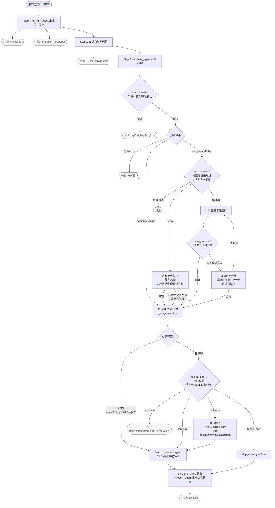

# 结构设计系统完整工作流

```mermaid
flowchart TD
    A([用户提交设计需求]) --> B[Step 1: design_agent 生成设计方案]

    B --> B1([终止: cancelled])
    B --> B2([失败: no_design_proposal])
    B --> C[Step 1.5: 结构类型预检]

    B1:::end_node
    B2:::end_node

    C --> C1([失败: 不支持的结构类型])
    C --> D[Step 2: analysis_agent 有限元分析]

    C1:::end_node

    D --> AH1{ask_human 1\n可视化模型预览确认}
    AH1 -- 取消 --> D1([终止: 用户取消可视化确认])
    AH1 -- 确认 --> D2{分析结果}

    D1:::end_node

    D2 -- 分析error --> D3([失败: 分析错误])
    D2 -- compliant=True --> E
    D2 -- compliant=False --> AH2

    D3:::end_node

    AH2{ask_human 2\n规范检查未通过\n含violations列表}
    AH2 -- terminate --> AH2T([终止])
    AH2 -- auto --> AUTO[自动迭代优化\n最多10轮\nLLM自动生成改进方案]
    AH2 -- manual --> MAN[LLM生成改进建议]

    AH2T:::end_node

    AUTO -- 合规 --> E
    AUTO -- 10轮后仍不合规\n带警告继续 --> E

    MAN --> AH3{ask_human 3\n请输入改进方案}
    AH3 -- skip --> E
    AH3 -- 输入改进文本 --> MAN2[LLM更新参数\n重新运行有限元分析\n跳过可视化]
    MAN2 -- 合规 --> E
    MAN2 -- 不合规 --> MAN

    E[Step 3: 设计评估\n_run_evaluation]
    E --> E1{有无预警?}
    E1 -- 无预警\n安全≥70 经济≥70 综合≥70 --> F
    E1 -- 有预警 --> AH4

    AH4{ask_human 4\n评估预警\n含得分 等级 预警列表}
    AH4 -- terminate --> AH4T([终止: user_terminated_after_evaluation])
    AH4 -- continue --> F
    AH4 -- optimize --> OPT[并行优化\n生成多方案选最优\n更新design/analysis/evaluation]
    AH4 -- report_only --> SKIP[skip_drawing = True]

    AH4T:::end_node

    OPT --> F
    SKIP --> G

    F[Step 4: drawing_agent\nCAD绘图 生成DXF]
    F --> G[Step 5: BIM/IFC导出\n+ report_agent 生成综合报告]
    G --> Z([完成: success])

    Z:::end_node

    classDef end_node fill:#f5f5f5,stroke:#999,color:#666
```
